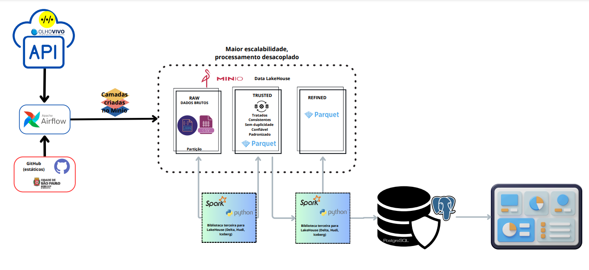

# Pipeline de Dados com Apache Airflow, Spark, Pandas, Postgres e Power BI

Este projeto configura um pipeline completo de engenharia de dados, utilizando o Apache Airflow para orquestração de tarefas, Spark para processamento distribuído de dados, Pandas para manipulação e análise de dados, Postgres como banco de dados relacional, e Power BI para visualização de dados. Todos os componentes estão integrados utilizando Docker e Docker Compose para facilitar o setup e a execução.

## Desenho de arquitetura



## Requisitos Mínimos

- Docker (versão 20.10 ou superior)
- Docker Compose (versão 1.29 ou superior)
- Python (versão 3.9 ou superior, se desejar executar scripts localmente)
- DBeaver (Versão 24.2 ou superior)
- Power BI
- Acesso à internet para baixar imagens e dependências

## Estrutura do Projeto

```
ENG_Dados/
├── airflow/
│   ├── dags/
│   │   ├── dag_DataAPI_BuscaLinhas_toPostgres.py
│   │   ├── dag_DataAPI_BuscaLinhas_toRaw.py
│   │   ├── dag_DataAPI_BuscaLinhas_toTrusted_toRefined.py
│   │   ├── dag_DataAPI_BuscarGaragem_toRaw.py
│   │   ├── dag_DataAPI_BuscarParadas_toPostgres.py
│   │   ├── dag_DataAPI_BuscarParadas_toRaw.py
│   │   ├── dag_DataAPI_BuscarParadas_toTrusted_toRefined.py
│   │   ├── dag_DataAPI_BuscarParadasPorLinha_toPostgres.py
│   │   ├── dag_DataAPI_BuscarParadasPorLinha_toRaw.py
│   │   ├── dag_DataAPI_BuscarParadasPorLinha_toTrusted_toRefined.py
│   │   ├── dag_DataAPI_BuscarPosicao_toPostgres.py
│   │   ├── dag_DataAPI_BuscarPosicao_toRaw.py
│   │   ├── dag_DataAPI_BuscarPosicao_toRefined.py
│   │   ├── dag_DataAPI_BuscarPosicao_toTrusted.py
│   │   ├── dag_DataAPI_BuscarPrevisaoLinha_toPostgres.py
│   │   ├── dag_DataAPI_BuscarPrevisaoLinha_toRaw.py
│   │   ├── dag_DataAPI_BuscarPrevisaoLinha_toRefined.py
│   │   ├── dag_DataAPI_BuscarPrevisaoLinha_toTrusted.py
│   │   ├── dag_StaticData_GTFS_toRaw.py
│   │   ├── dag_StaticData_PassTransportados_toPostgres.py
│   │   ├── dag_StaticData_PassTransportados_toRaw.py
│   │   ├── dag_StaticData_PassTransportados_toRefined.py
│   │   └── dag_StaticData_PassTransportados_toTrusted.py
│   └── data/
│       └── arquivos_estaticos.csv
├── docker/
│   ├── Dockerfile
│   └── docker-compose.yml
├── .env
├── poetry.lock
├── pyproject.toml
├── requirements.txt
└── README.md
```

## Funcionamento do Pipeline

### Coleta e Ingestão de Dados
- As DAGs no Apache Airflow buscam dados de duas fontes principais:

- API Olho Vivo: Dados dinâmicos como posições de ônibus, previsão de chegada e informações de linhas e paradas.
Arquivos Estáticos: Dados GTFS e dados de transporte de passageiros armazenados na pasta airflow/data.
Esses dados são armazenados inicialmente na camada raw no MinIO, estruturada para manter os dados brutos em seu formato original.

### Processamento e Tratamento de Dados
- Pandas e Spark são usados para transformar e tratar os dados:
    - Pandas realiza operações de limpeza e manipulação em pequenos conjuntos de dados.
    - Spark é utilizado para processar grandes volumes de dados de forma distribuída.
- Após o processamento, os dados tratados são salvos no MinIO nas camadas trusted e refined em formato Parquet, facilitando análises futuras.

### Armazenamento e Visualização
- Os dados finais na camada refined são movidos para a camada business e armazenados no banco de dados Postgres.
- Power BI conecta-se ao Postgres para criar dashboards interativos com os dados processados, permitindo visualização e análise.
Inicializar o Ambiente

## Explicação das DAGs
As DAGs no projeto são responsáveis por orquestrar a ingestão e transformação dos dados de diferentes fontes:

DAGs de API Olho Vivo: Extraem dados de APIs, como dag_DataAPI_BuscaLinhas, dag_DataAPI_BuscarParadas e dag_DataAPI_BuscarPosicao. Os dados brutos são armazenados em uma camada raw no MinIO, garantindo que as fontes originais sejam preservadas.

DAGs de Dados Estáticos: Processam dados de arquivos estáticos, como dag_StaticData_GTFS_toRaw, que manipula dados de transporte em massa e outros registros em formato GTFS.

Após a ingestão dos dados na camada raw, as DAGs realizam transformações usando Python/Pandas para tratamentos e limpeza de dados, movendo-os para as camadas trusted e refined no MinIO em formato Parquet.

Por fim, as camadas refined são carregadas na camada business no Postgres. A partir desse banco de dados, os dados são conectados ao Power BI para construção de dashboards e visualizações.

## Inicializar o Ambiente

Para inicializar o serviço, abra o docker desktop e utilize o comando:

```shell
docker compose -f docker/docker-compose.yml up --build
```

> *Caso não funcione o comando acima*, utilize `docker-compose` no lugar de `docker compose`

Usar `Ctrl+C` para parar a execução do ambiente

## Parar remover os containers do Ambiente

Para parar todos os contêineres do ambiente, utilize o comando:
```shell
docker compose -f docker/docker-compose.yml down
```

## Criar o Usuário para Fazer Login no Airflow

Após inicializar o serviço, crie um usuário admin para acessar a interface do Airflow:

1. abra outro poweShell e acesse o container do webserver:

```shell
docker compose -f docker/docker-compose.yml exec webserver bash
```

2. No container, crie o usuário admin:

```shell
airflow users create \
    --username admin \
    --firstname Firstname \
    --lastname Lastname \
    --role Admin \
    --email admin@example.com \
    --password admin
```

## Configurar o Minio
1. Acesse a interface do Airflow em [http://localhost:8080](http://localhost:8080) e faça login com as credenciais abaixo.
    user: admin
    senha: minioadmin
2. Vá para `Access Keys` -> `Create Access Key`
3. Edite os campos abaixo e clique em `Create`:
- **Access Key**: `datalake`
- **Secret Key**: `datalake`


## Configurar o Postgres
1. Acesse a interface do DBeaver instalado na máquina e crie uma nova conexão com as credenciais abaixo.
- **Conecte usando**: `Host`
- **Hosts**: `host.docker.internal`
- **Porta**: `5432`
- **Banco de Dados**: `postgres`
- **Nome de usuário**: `airflow`
- **Senha**: `airflow`
- **user**: admin
- **senha**: minioadmin

## Configurar o Power BI para conexão com o banco de dados Postgres
1. Acesse a interface do Power BI instalado na máquina e obtenha as bases utilizando as credencias abaixo.
- **Servidor**: `localhost:5432`
- **Banco de Dados**: `postgres`
- **Nome de usuário**: `airflow`
- **Senha**: `airflow`


## Monitoramento de Logs

Certifique-se de que a configuração acima esteja correta para evitar problemas de acesso aos logs.

## Licença

Este projeto é licenciado sob os termos da licença MIT.
